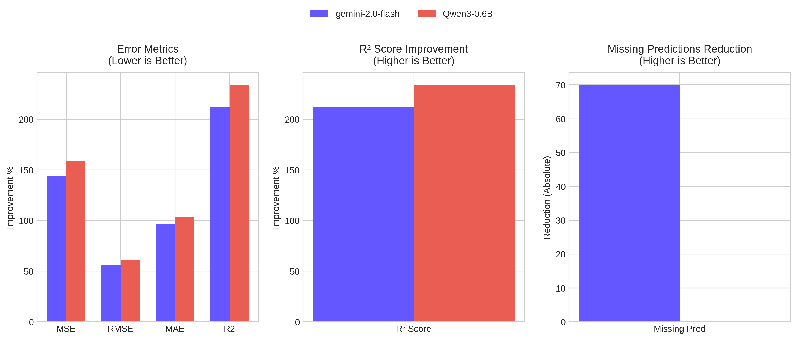

# Fine-Tuning Qwen3-0.6B for US Real Estate Price Prediction Using LoRA and LLaMA Factory

## Project Overview

This project presents the fine-tuning of the [Qwen3-0.6B](https://huggingface.co/Qwen/Qwen3-0.6B) large language model using [LoRA (Low-Rank Adaptation)](https://arxiv.org/abs/2106.09685) and the [LLaMA-Factory](https://github.com/hiyouga/LLaMA-Factory) framework. The objective is to build a domain-specific model that can generate accurate price predictions for real estate properties in the United States, based on natural language input.

The model is trained on text-converted tabular property listings and evaluated against baseline models such as the base Qwen3-0.6B and Gemini API outputs.

## Workflow & Project Structure

1. **Data Preparation** → Explore, clean, and convert tabular data to prompt-based instructions
2. **Baseline Evaluation** → Use pretrained base Qwen and Gemini as a basseline evaluation.
3. **Fine-Tuning** → Train using LoRA with LLaMA-Factory
4. **Model Comparasion** → Extract predictions from the generated text responses and dump them in JSON format for regression metrics comparasion between models.

## Project Structure

<div align="center">
  
  <p><em>Figure: End-to-end fine-tuning workflow for Qwen3-0.6B</em></p>
</div>


## Used Tools

| Tool/Platform          | Purpose                                                                                                  |
| ---------------------- | -------------------------------------------------------------------------------------------------------- |
| **LLaMA Factory**      | Framework for fine-tuning LLMs like Qwen using LoRA adapters                                             |
| **Hugging Face**       | Hosting datasets and model adapters, also for inference and sharing                                      |
| **GenAI (Gemini)**     | Used to generate baseline outputs from Google's Gemini model                                             |
| **Kaggle**             | GPU runtime for data exploration, training, and hosting public datasets                                  |
| **Google Colab**       | GPU environment for training and experimentation                                                         |
| **VS Code**            | Local development environment for code editing and debugging                                             |
| **Google Drive**       | Persistent storage for model weights, checkpoints, and logs                                              |
| **Python & Libraries** | Language used for the full pipeline including pandas, scikit-learn, matplotlib, transformers, peft, etc. |


## Infrastructure

* **Training GPUs**: Used Kaggle and Google Colab free GPU environments
* **Constraints**: Due to hardware limitations, only a subset of the full dataset was used for fine-tuning.


## Fine-Tuning Strategy

Fine-tune the **`Qwen3-0.6B`** model using [LoRA](https://arxiv.org/abs/2106.09685) with the **LLaMA-Factory** framework. The goal is to adapt the model for real estate-specific tasks, such as predicting house prices based on structured and natural language data.

* **Fine-Tuning Type**: `lora`
* **LoRA Rank**: 64
* **LoRA Target**: All attention layers
* **Precision**: bf16 (bfloat16)
* **Training Engine**: LLaMA-Factory

This is the YAML configration for fine-tuning, full detail in the [here](https://github.com/heba14101998/Qwen-LoRA-Estate/blob/main/real_estate_qwen3_lora.yaml)

```yaml
model_name_or_path: Qwen/Qwen3-0.6B
stage: sft
finetuning_type: lora
lora_rank: 64
lora_target: all
cutoff_len: 3500
bf16: true
learning_rate: 1.0e-4
num_train_epochs: 3.0
gradient_accumulation_steps: 8
per_device_train_batch_size: 1
lr_scheduler_type: cosine
warmup_ratio: 0.1
eval_strategy: steps
eval_steps: 100
metric_for_best_model: eval_loss
```

## Dataset & Preprocessing

* **Total Records Available**: \~2,000,000
* **Used for Fine-Tuning**:

  * 5,000 training examples
  * 200 validation examples

> ⚠️ **Note**: Due to infrastructure constraints, the full dataset could not be used in this experiment. Scaling this to larger datasets is part of the future work.

* **Original Dataset**: [USA Real Estate Dataset](https://www.kaggle.com/datasets/ahmedshahriarsakib/usa-real-estate-dataset)
* **Converted Dataset**: 

  * Cleans and preprocesses the data (handling missing values, outliers, data types)
  * Translated the full \~2M dataset from tabular Data to natural language hosted in [Kaggle](https://www.kaggle.com/datasets/hebamo7amed/llm-real-estate-text-data/data) and [Hugging Face](https://huggingface.co/datasets/heba1998/real-estate-data-for-llm-fine-tuning)
  * Refactored datasets or training and validation in LlaMa-Factory Style hosted in [Hugging Face](https://huggingface.co/datasets/heba1998/real-estate-data-sample-for-llm-fine-tuning)


### Input Format  for finue-tuning usin LLaMA-Factory

This real sample from my dataset

````json
{
  "system": "You are an expert in real estate price estimation with experience in the housing market.\nGiven the following house features, predict the final sale price.\n#### Critical notes:\n- Some feature values are missing.\n- Broker ID and street are encoded for privacy.\n- Do not include any introduction or conclusion.",
  "instruction": "A house listing in the USA with the following details:\n\n- Status: for_sale\n\n- Number of bedrooms: -1\n\n- Number of bathrooms: -1\n\n- Land size: 0.07000000029802322 acres\n\n- Address (city, state, zip): Washington, District of Columbia, 20002.0\n- House size: -1.0 sqft\n\nYour task is to predict the final sale price in $?\n### Output schema:\n{'properties': {'estimated_house_price': {'description': 'Numerical value that expresses the estimated house price', 'example': 85000.0, 'title': 'Estimated House Price', 'type': 'number'}}, 'required': ['estimated_house_price'], 'title': 'ResponseSchema', 'type': 'object'}\n### Response: \n ```json",
  "input": "",
  "output": "{\"estimated_house_price\":2500000.0}",
  "history": []
}
````

## Evaluation Methodology

### In Fine-Tuning
During Fine-tuning the evaluation function `eval_dataset` that uses the average negative log-likelihood loss for optimize the language modle.

### Task Evaluation

After training, we extracted the predicted house prices from the model's JSON responses and conducted a **regression-based evaluation** using standard metrics (MSE, RMSE, MAE, and R-Squred). 

The evaluation results demonstrate that the fine-tuned **Qwen3-0.6B + LoRA** model significantly outperforms both the base **Qwen3-0.6B** and **Gemini2-flash-exp** models in terms of **MAE** and **R-Squared**, despite being trained on only **5,000** samples and evaluated on a small validation set of **200** samples.


| **Model Name**         | **MAE**       | **R-Squared**       | **Supports** | **Eval Time (min)** | **Response Time (min)** | **Missing Predictions (%)** | **Validation Device** |
|-------------------------|---------------|---------------------|--------------|---------------------|-------------------------|-----------------------------|------------------------|
| **Gemini2-flash-exp**   | 403870.53     | -0.5416020237160029 | 200          | 2.82                | 0.0141                  | 0.0                         | gpu-t4x2              |
| **Base Qwen3-0.6B**     | 390199.94     | -0.4536350090185375 | 200          | 2.45                | 0.01225                 | 70.0                        | remote-api            |
| **Qwen3-0.6B + LoRA**   | 198903.515    | 0.40409901976362583 | 200          | 2.82                | 0.0141                  | 0.0                         | gpu-t4x2              |

<div align="center">
  
  <p><em>Figure: Performance Comparison of our Qwen-LoRA over the other Evaluated Models</em></p>
</div>

#### Observations:
- The **Qwen3-0.6B + LoRA** model achieves the lowest **MAE** of **198,903.515**, indicating it provides the most accurate predictions among the evaluated models.
- The **R-Squared** value of **0.4041** for the fine-tuned model indicates a moderate level of variance explained by the model, suggesting it captures some underlying patterns in the data.
- **Gemini2-flash-exp** and **Base Qwen3-0.6B** models perform poorly, with negative **R-Squared** values, suggesting they fail to capture the variance in the data.
- The fine-tuned model demonstrates robustness with **0% missing predictions**, unlike the base model with **70% missing predictions**.
- Evaluation and response times are comparable across all models, showing no significant latency introduced by fine-tuning.
- The fine-tuned model's performance improvement is achieved despite the limited training dataset size.


## Adapter Output

The trained LoRA adapter is exported and available publicly via Hugging Face:

**🧠 Hugging Face Adapter**: [Qwen-LoRA-Estate](https://huggingface.co/heba1998/Qwen-LoRA-Estate)

### How to Use

You can apply the adapter to the base `Qwen3-0.6B` model using LLaMA-Factory’s CLI or Hugging Face's PEFT library for downstream inference.

## Future Work

* **Scale to Full Dataset**: Fine-tune the model on the complete 2M+ real estate records for better generalization.

* **Model Serving**:

  * Use **vLLM** for efficient token streaming and parallel inference.
  * **UI Demonsration**: We can host the model with the adaptor using Hugging Face Inference Endpoints or an API gateway
